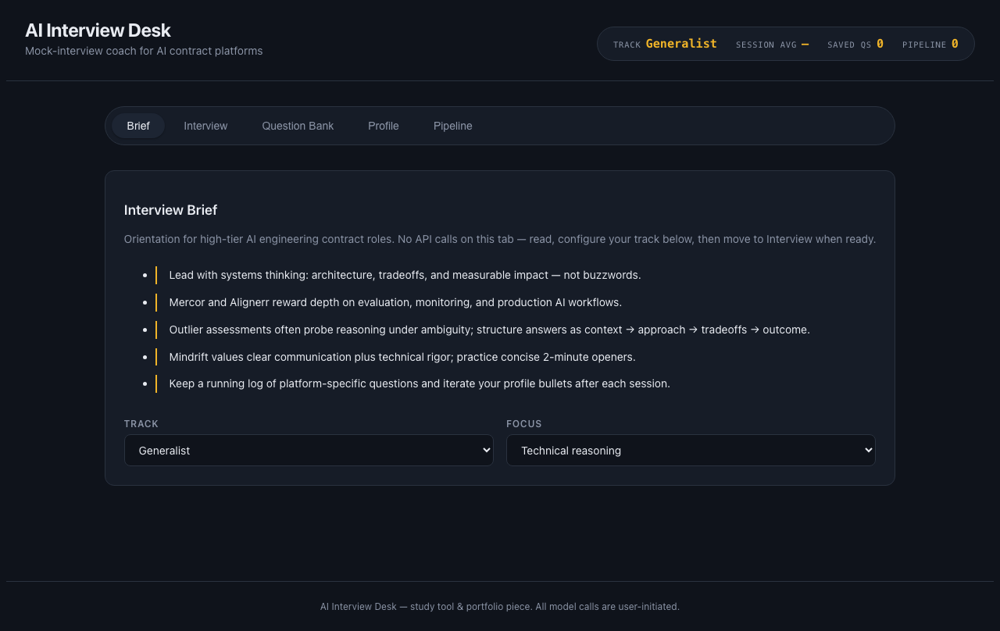

# AI Interview Desk

An AI-powered mock-interview coach, profile optimizer, and application tracker for AI-engineering contract platforms (Mercor, Outlier, Mindrift, Alignerr).



**[Live demo](https://ai-interview-desk.vercel.app)** · **[Repository](https://github.com/Berko207/ai-interview-desk)**

[](https://vercel.com/new/clone?repository-url=https://github.com/Berko207/ai-interview-desk&env=OPENROUTER_API_KEY)

## What it does

- **Interview brief** — orientation and track/focus setup before you practice
- **AI mock interview with scoring** — generate platform-realistic questions, answer in prose, get a 1–10 score with strengths, gaps, and a stronger rewrite
- **Question bank** — save generated questions locally and reload them for repeat practice
- **AI profile builder** — turn raw stack and project notes into matcher-friendly headline, summary, and bullets
- **Application pipeline** — track roles and status across Mercor, Outlier, Mindrift, Alignerr, and others

## How it works

Built on the Next.js App Router. A single `/api/interview` route holds `OPENROUTER_API_KEY` server-side and proxies to [OpenRouter](https://openrouter.ai) (OpenAI-compatible chat completions), so the key never reaches the browser. The UI persists state in `localStorage`; Supabase is a drop-in upgrade for cross-device sync. Default model is `openrouter/free` (no credits required); set `OPENROUTER_MODEL=anthropic/claude-3.5-haiku` in one line for higher-quality responses.

All model calls are user-initiated (OpenRouter bills per call).

## Tech stack

Next.js 15, React 19, TypeScript, OpenRouter, hand-rolled CSS design system, Vercel.

## Run locally

```bash
git clone https://github.com/Berko207/ai-interview-desk.git
cd ai-interview-desk
cp .env.example .env.local
# Add your OpenRouter key to .env.local
npm install
npm run dev
```

Open [http://localhost:3000](http://localhost:3000).

## Roadmap

- Spoken-answer mode with transcription
- Supabase sync for questions, scores, and pipeline data
- Harder Outlier-style coding questions

## License

MIT
